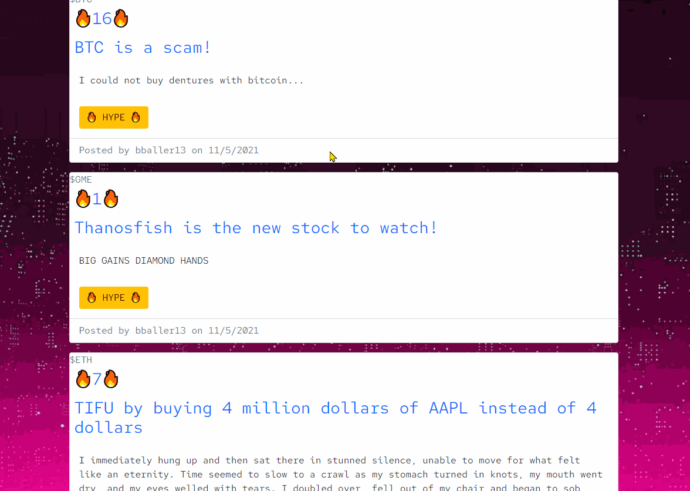
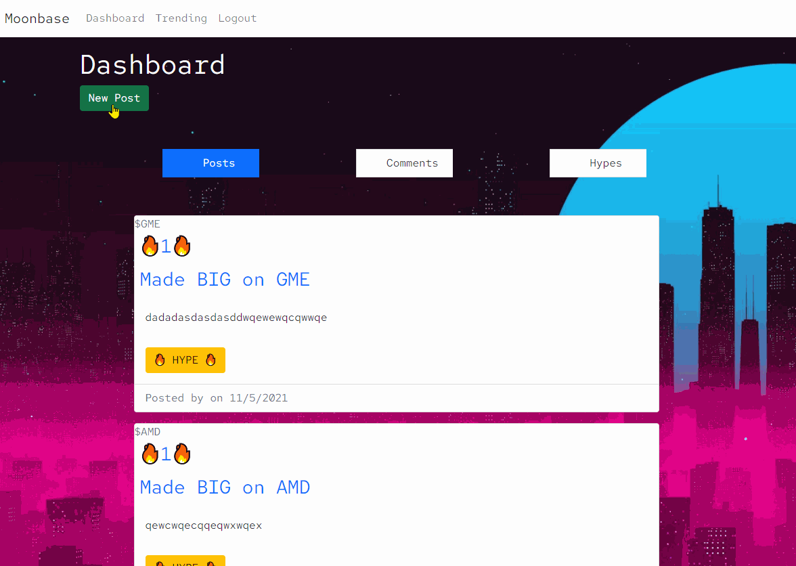
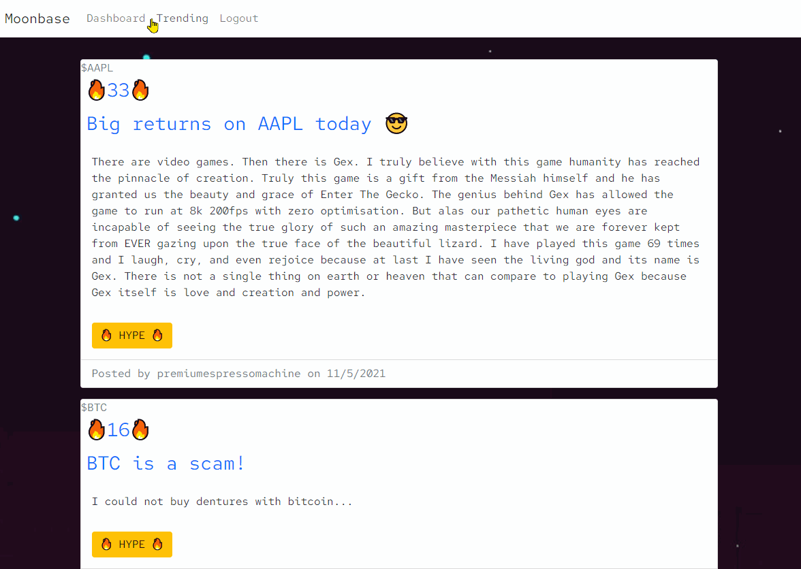
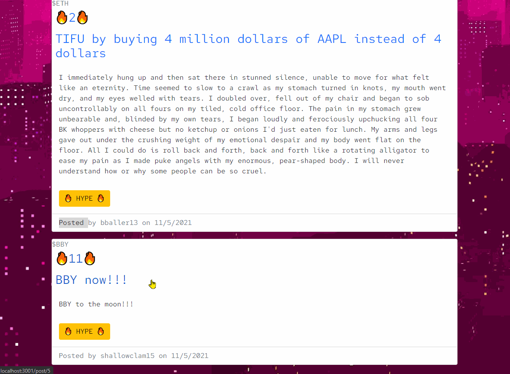

# Moonbase
[](https://opensource.org/licenses/MIT)

---

## Table of Contents

- [moonbase](#moonbase)
  - [Table of Contents](#table-of-contents)
  - [Description](#description)
  - [Features](#features)
  - [Prerequisites](#prerequisites)
  - [Built With](#built-with)
  - [Technologies Used](#technologies-used)
  - [Practices Used](#practices-used)
  - [Important Code Snippets](#important-code-snippets)
  - [Deployed Link](#deployed-link)
  - [Authors](#authors)
  - [License](#license)
  - [Questions](#questions)
  

## Description

Moonbase is a dedicated investment forum with integrated stock data. Users no longer have to leave the website to view trending stocks and data!

With the advent of Robinhood and other retail investment platforms, interest in investing as a hobby and as a means of income has skyrocketed among the general population. The Reddit forum Wallstreetbets is the most popular investment discussion place on the internet, however, it lacks integration of stock data. Users have to leave the site to view prices and other information. That is a lot of lost potential ad-revenue!

Moonbase solves this problem by being investors one-stop-shop to talk about and view stock data! Being a dedicated investment forum, we can also add more nuance to how the forum is used and provide tools to keep users engaged.


**[Click this link to go to Moonbase!](https://guarded-chamber-67294.herokuapp.com/)**
 <br />


## Features

**Browse posts and "hype" them up!**
* "Hypes" are user-engagement points that are awarded to users for doing social activities like creating posts or comments. Users can then expend their hypes to "hype up" posts that they think are important. Post can be hyped up any number of times. The more that a user is active, the more influence that user can have on the site.

 <br />

**Create new posts and display automatically generated stock values**
* Users can create posts and indicate if they think the stock is bullish or bearish. When a user submits their post, Moonbase will automatically pull the current stock price, dollar change, and percent change and add it to the post.

 <br />

**View which stocks are trending in the market**
* Users can see which stock are trending from *within* the Moonbase website. No need to leave the website to view this information!

 <br />

**View the market data for a post's stock**
* Users can view the current market data for post's stock from *within* the Moonbase website too!

 <br />

**Add bullish/bearish flair to a post or comment**
* Users can add bullish or bearish flairs to posts and comments to share their opinion on the stock sentiment.


## Prerequisites
Any modern internet browser will do!

## Built With

* [CSS](https://developer.mozilla.org/en-US/docs/Web/CSS)
* [JavaScript](https://developer.mozilla.org/en-US/docs/Web/JavaScript)
  * [bcrypt](https://www.npmjs.com/package/bcrypt)
  * [dotenv](https://www.npmjs.com/package/dotenv)
  * [Express Handlebars](https://www.npmjs.com/package/express-handlebars)
  * [MySQL2](https://www.npmjs.com/package/mysql2)
  * [Node.js](https://nodejs.org/en/)
  * [nodemon](https://nodemon.io/)
  * [Sequelize](https://sequelize.org/)
* [MySQL](https://www.mysql.com)
* [Finnhub Stock API](https://finnhub.io/docs/api)
* [Axios](https://www.npmjs.com/package/axios)
* [Cheerio Web Scraper](https://www.npmjs.com/package/cheerio)
* [Bootstrap](https://getbootstrap.com/)


## Technologies Used

* [Microsoft Visual Studio Code](https://code.visualstudio.com/)
* [Git Bash](https://git-scm.com/downloads)
* [GitHub](https://github.com/)
* [Google Chrome Developer Tools](https://developer.chrome.com/docs/devtools/)

## Practices Used

* Agile style User Story and Acceptance Criteria.
* [Web Content Accessibility Guidelines](https://www.w3.org/WAI/standards-guidelines/wcag/)

## Important Code Snippets

**DOM traversal for generating our post feed**
* This snippet selects all of our post's hype counts displayed and then updates them on the page. 
```
var hypeCounts = document.querySelectorAll('#hypecount');

hypeCounts.forEach((post) => {
    var postId = post.parentNode.parentNode.parentNode.dataset.postId
    fetch(`api/hype/posts/${postId}/hypecount`)
    .then((response) => response.json()) 
    .then((hype) => {
        post.innerHTML = hype.count;
    });
});
``` 
<br />

**Finnhub Price Quote for a Stock**
* This code allows us to return the current price from Finnhub for any given stock ticker.
```
const axios = require("axios");
require('dotenv').config();
const baseUrl = 'https://finnhub.io/api/v1/';
const apiKey = `&token=${process.env.API_KEY}`;

async function stockQuote(ticker) {
    try {
        let userQuote = ticker;
            const completeQuoteQuery = `${baseUrl}quote?symbol=${userQuote}${apiKey}`;
            const response = await axios.get(completeQuoteQuery);
            return response.data;
    } catch (err) {
        console.error(err);
    }
}
``` 
<br />


**Cheerio Web Scrape for Yahoo's Trending Stocks**
* This code allows us to use Cheerio to scrape the trending stocks from [Yahoo Finance's Trending stock page](https://finance.yahoo.com/trending-tickers/). We also cut out any foreign index stocks.
```
const cheerio = require('cheerio');
const axios = require("axios");
const quotePrice = require('./axios-quote');
const yahooTrendingUrl = "https://finance.yahoo.com/trending-tickers/";

async function loadTrending() {
    try {
        var trendingStock = [];
        const response = await axios.get(yahooTrendingUrl)
        const $ = cheerio.load(response.data);
        $('a[data-test=quoteLink]').each((i, element) => {
            trendingStock.push({
                ticker: element.children[0].data,
                name: element.attribs.title,
                price: 0,
                change: 0,
                percent_change: 0,
                open: 0,
                high: 0,
                low: 0
            });
        });

        for (var i = 0; i < trendingStock.length; i++) {
            let badStock = trendingStock[i].ticker;
            if (badStock.includes(".")) {
                trendingStock.splice(i, 1);
            }
        }
        return trendingStock;
    } catch (err) {
        console.error(err);
    }
}
``` 
<br />

## Deployed Link

* [See the Live Site!](https://guarded-chamber-67294.herokuapp.com/)

## Authors

**Alexander Gibson** 

- [Link to Alex's Github](https://github.com/argibson02)
- [Link to Alex's LinkedIn](www.linkedin.com/in/alexander-gibson-1b0bb6105)

**Gabriel Lantin**

- [Link to Gabriel's Github](https://github.com/mushymane)
- [Link to Gabriel's LinkedIn](https://www.linkedin.com/in/luigilantin/)

**Henry Kam**

- [Link to Henry's Github](https://github.com/gulpinhenry)
- [Link to Henry's LinkedIn](https://www.linkedin.com/in/kamhenry/)


## License

This application is covered under the MIT license.

## Questions

For any questions, please reach out by creating an issue.